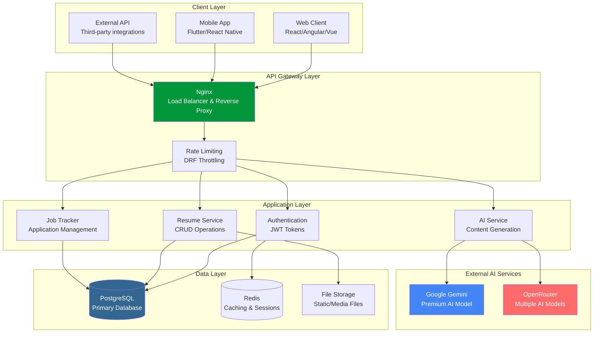
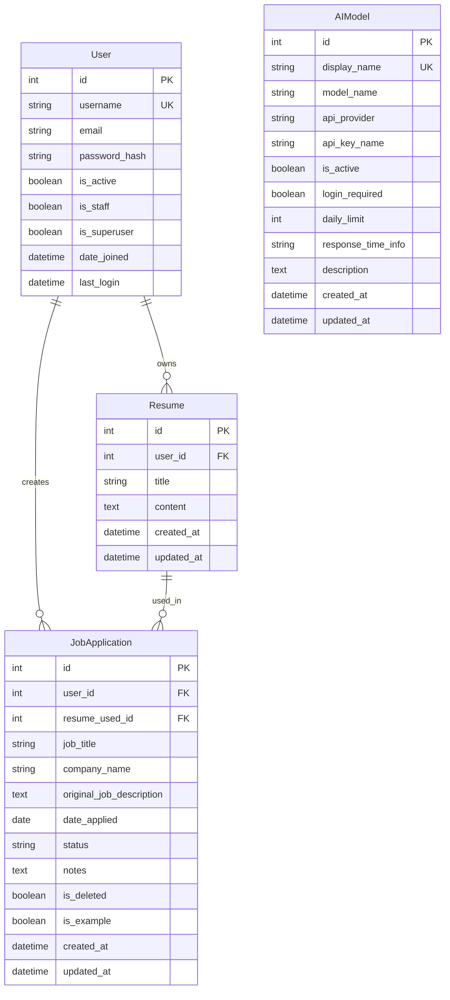
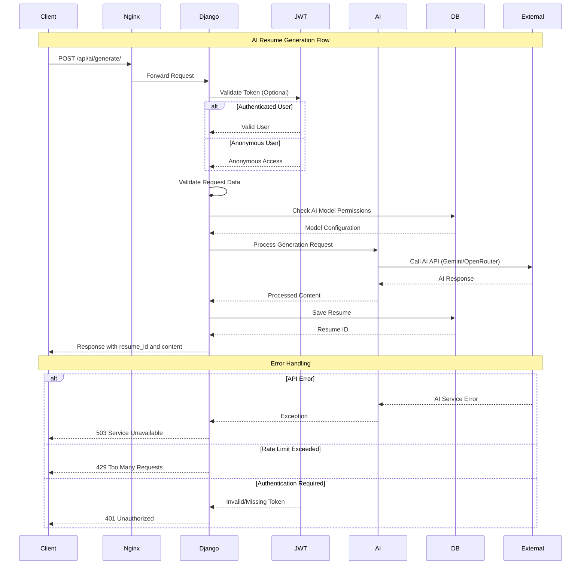
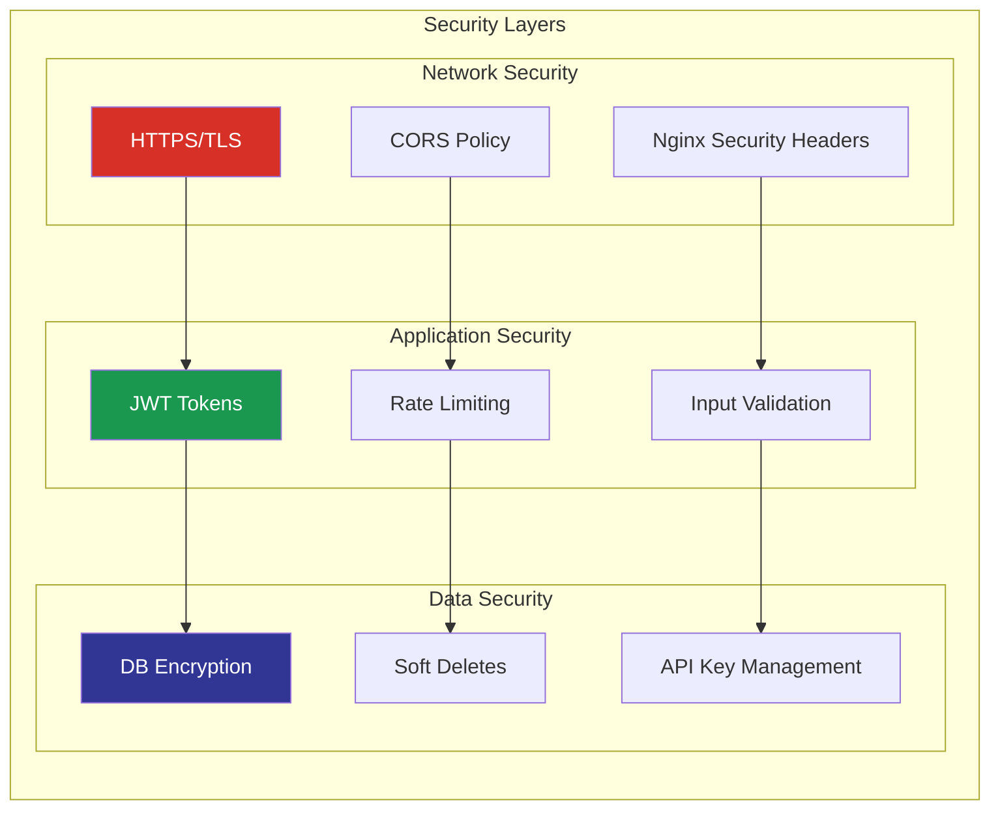
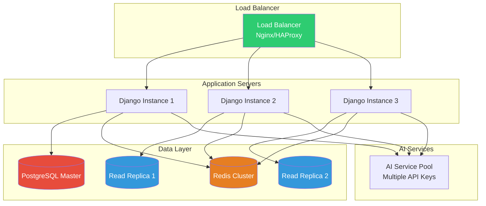
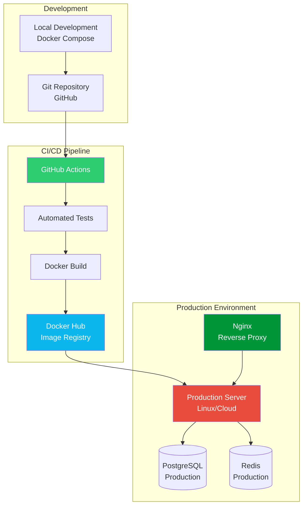

# 🏗️ ResuMate Architecture

!!! abstract "Architecture Overview"
    Modern, scalable Django REST API with AI integration, containerized deployment, and enterprise-grade database design.

---

## 🎯 High-Level Architecture

!!! note "System Components"
    ResuMate follows a **3-tier architecture** with clear separation of concerns, microservices-ready design, and horizontal scalability.



---

## 📊 Database Schema (ERD)

!!! info "Entity Relationship Diagram"
    PostgreSQL database with optimized relationships, soft deletes, and audit trails.



**Key Database Features:**

=== "🔑 Primary Relationships"
    
    - **User ↔ Resume**: One-to-Many (User can have multiple resumes)
    - **User ↔ JobApplication**: One-to-Many (User can have multiple applications) 
    - **Resume ↔ JobApplication**: One-to-Many (Resume can be used for multiple applications)
    - **Anonymous User Support**: Special user account for non-authenticated resume generation

=== "🛡️ Data Integrity"
    
    - **Soft Deletes**: JobApplication uses `is_deleted` flag instead of hard deletion
    - **Audit Trails**: All models include `created_at` and `updated_at` timestamps
    - **Cascade Protection**: Resume deletion sets JobApplication.resume_used to NULL
    - **Unique Constraints**: Username and AI model display names enforced at DB level

=== "⚡ Performance Optimizations"
    
    - **Indexed Fields**: Foreign keys automatically indexed for fast joins
    - **Selective Queries**: Default filtering excludes soft-deleted records
    - **Connection Pooling**: PostgreSQL with psycopg2-binary for optimized connections
    - **Query Optimization**: Django ORM with select_related and prefetch_related

---

## 🔄 API Request Flow

!!! success "Request Processing Pipeline"
    Complete request lifecycle from client to response with security, validation, and AI integration.



**Flow Breakdown:**

=== "1️⃣ Authentication Layer"
    
    ```python
    # JWT Token Validation
    if token_provided:
        user = authenticate_jwt(token)
        permissions = get_user_permissions(user)
    else:
        user = AnonymousUser()
        permissions = get_anonymous_permissions()
    ```

=== "2️⃣ Business Logic Layer"
    
    ```python
    # AI Model Selection & Validation
    model = AIModel.objects.get(
        display_name=request_data['model'],
        is_active=True
    )
    
    if model.login_required and not user.is_authenticated:
        raise PermissionError("Authentication required")
    ```

=== "3️⃣ External Service Integration"
    
    ```python
    # AI API Call with Error Handling
    try:
        ai_response = generate_resume_content(
            model_instance=model,
            user_input=request_data['user_input']
        )
    except Exception as e:
        return Response(
            {"error": "AI service unavailable"}, 
            status=503
        )
    ```

---

## 🔧 Technology Stack

!!! note "Modern Tech Stack"
    Enterprise-grade technologies chosen for scalability, performance, and maintainability.

=== "🎯 Backend Core"
    
    <div class="premium-table">
    
    | Component | Technology | Version | Purpose |
    |:---------:|:----------:|:-------:|:--------|
    | **🎯 Framework** | <span class="tech-highlight">Django</span> | <span class="version-badge">5.0.14</span> | Web framework & ORM |
    | **🔌 API Layer** | <span class="tech-highlight">Django REST Framework</span> | <span class="version-badge">Latest</span> | RESTful API development |
    | **🗄️ Database** | <span class="tech-highlight">PostgreSQL</span> | <span class="version-badge">16+</span> | Primary data storage |
    | **⚡ Caching** | <span class="tech-highlight">Redis</span> | <span class="version-badge">7+</span> | Session & query caching |
    | **🔐 Authentication** | <span class="tech-highlight">JWT</span> | <span class="version-badge">simplejwt</span> | Stateless authentication |
    
    </div>

=== "🤖 AI Integration"
    
    <div class="premium-table ai-table">
    
    | Service | Provider | Model | Access Level |
    |:-------:|:--------:|:-----:|:-------------|
    | **🧠 Google Gemini** | <span class="provider-google">Google AI</span> | <span class="model-premium">gemini-2.0-flash-exp</span> | <span class="access-auth">🔐 Authenticated (5/day)</span> |
    | **🚀 Deepseek** | <span class="provider-openrouter">OpenRouter</span> | <span class="model-free">deepseek/deepseek-r1</span> | <span class="access-public">🌐 Public (Unlimited)</span> |
    | **⚡ Cypher** | <span class="provider-openrouter">OpenRouter</span> | <span class="model-free">teknium/openhermes-2.5</span> | <span class="access-public">🌐 Public (Unlimited)</span> |
    
    </div>

=== "🐳 DevOps & Infrastructure"
    
    <div class="premium-table devops-table">
    
    | Component | Technology | Purpose |
    |:---------:|:----------:|:--------|
    | **🐳 Containerization** | <span class="tech-highlight">Docker + Compose</span> | Development & deployment |
    | **🔄 CI/CD** | <span class="tech-highlight">GitHub Actions</span> | Automated testing & deployment |
    | **🌐 Web Server** | <span class="tech-highlight">Gunicorn + Nginx</span> | Production WSGI server |
    | **📊 Monitoring** | <span class="tech-highlight">Django Logging</span> | Error tracking & performance |
    | **📁 Static Files** | <span class="tech-highlight">WhiteNoise</span> | Static asset serving |
    
    </div>

---

## 🛡️ Security Architecture

!!! warning "Security Features"
    Multi-layered security approach with authentication, authorization, and data protection.



**Security Implementation:**

=== "🔐 Authentication"
    
    - **JWT Tokens**: Stateless, secure token-based authentication
    - **Token Refresh**: Automatic token renewal for seamless UX
    - **Anonymous Access**: Limited functionality for non-authenticated users
    - **Permission Levels**: Granular access control per endpoint

=== "🛡️ Data Protection"
    
    - **Environment Variables**: Sensitive data stored securely
    - **API Key Rotation**: Support for key rotation without downtime
    - **Soft Deletes**: Data retention for audit and recovery
    - **SQL Injection Protection**: Django ORM prevents SQL injection

=== "⚡ Performance Security"
    
    - **Rate Limiting**: Per-user and per-endpoint throttling
    - **Request Size Limits**: Protection against large payload attacks
    - **Connection Pooling**: Efficient database connection management
    - **Static File Security**: Secure serving of user-generated content

---

## 📈 Scalability Design

!!! tip "Horizontal Scaling"
    Designed for growth with microservices-ready architecture and cloud deployment.



**Scalability Features:**

=== "🔧 Application Scaling"
    
    - **Stateless Design**: No server-side sessions, JWT for authentication
    - **Docker Containers**: Easy horizontal scaling with container orchestration
    - **Load Balancing**: Multiple Django instances behind load balancer
    - **Microservices Ready**: Clear service boundaries for future splitting

=== "💾 Database Scaling"
    
    - **Read Replicas**: Separate read and write database instances
    - **Connection Pooling**: Efficient database connection management
    - **Query Optimization**: Indexed queries and relationship optimization
    - **Caching Strategy**: Redis for session and query result caching

=== "🤖 AI Service Scaling"
    
    - **Multiple API Keys**: Round-robin across different API keys
    - **Model Selection**: Dynamic AI model selection based on load
    - **Retry Logic**: Automatic retry with exponential backoff
    - **Circuit Breaker**: Fail-fast pattern for external service calls

---

## 🚀 Deployment Architecture

!!! success "Production Deployment"
    Docker-based deployment with CI/CD automation and environment management.



**Deployment Process:**

=== "🔄 Continuous Integration"
    
    ```yaml
    # GitHub Actions Workflow
    name: CI/CD Pipeline
    on: [push, pull_request]
    
    jobs:
      test:
        runs-on: ubuntu-latest
        steps:
          - name: Run Tests
            run: docker-compose -f docker-compose.test.yml up --abort-on-container-exit
      
      build:
        needs: test
        runs-on: ubuntu-latest
        steps:
          - name: Build & Push Docker Image
            run: |
              docker build -t resumate:${{ github.sha }} .
              docker push resumate:${{ github.sha }}
    ```

=== "🐳 Container Strategy"
    
    - **Multi-Stage Builds**: Optimized production images
    - **Environment Separation**: Different configurations for dev/staging/prod
    - **Health Checks**: Container health monitoring and auto-restart
    - **Volume Management**: Persistent data and log volumes

=== "📊 Monitoring & Maintenance"
    
    - **Application Logs**: Structured logging with Django logging framework
    - **Error Tracking**: Centralized error collection and alerting
    - **Performance Metrics**: Database query optimization and response times
    - **Backup Strategy**: Automated database backups and recovery procedures

---

## 💡 Design Decisions & Trade-offs

!!! abstract "Architectural Choices"
    Key decisions made for performance, maintainability, and scalability.

=== "🎯 Framework Choice: Django REST Framework"
    
    **Why Django REST Framework?**
    
    ✅ **Advantages:**
    - Rapid API development with built-in serialization
    - Robust authentication and permission system
    - Extensive ecosystem and community support
    - Built-in admin interface for data management
    - ORM provides database abstraction and migrations
    
    ⚠️ **Trade-offs:**
    - Higher memory footprint compared to FastAPI
    - Python GIL limitations for CPU-intensive tasks
    - Learning curve for Django conventions

=== "🗄️ Database Choice: PostgreSQL"
    
    **Why PostgreSQL over MongoDB?**
    
    ✅ **Advantages:**
    - ACID compliance for data integrity
    - Complex relationships between Users, Resumes, JobApplications
    - Mature ecosystem with excellent Django integration
    - Advanced indexing and query optimization
    - JSON field support for flexible resume content storage
    
    ⚠️ **Trade-offs:**
    - Vertical scaling limitations
    - Schema migrations required for structure changes
    - More complex than NoSQL for simple document storage

=== "🤖 AI Integration Strategy"
    
    **Why Multiple AI Providers?**
    
    ✅ **Advantages:**
    - Risk mitigation - no single point of failure
    - Cost optimization - use free models for anonymous users
    - Performance diversity - different models for different use cases
    - Rate limit distribution across multiple services
    
    ⚠️ **Trade-offs:**
    - Increased complexity in AI service management
    - Multiple API keys and configurations to maintain
    - Inconsistent response formats between providers

=== "🔐 Authentication Strategy: JWT"
    
    **Why JWT over Session-based Authentication?**
    
    ✅ **Advantages:**
    - Stateless - no server-side session storage required
    - Scalable across multiple server instances
    - Mobile-friendly with token-based approach
    - Built-in expiration and refresh token support
    
    ⚠️ **Trade-offs:**
    - Token size larger than session IDs
    - Cannot revoke tokens before expiration
    - More complex client-side token management

---

!!! success "Architecture Summary"
    ResuMate's architecture successfully balances **performance**, **scalability**, and **maintainability** through:
    
    - **🎯 Clear Separation of Concerns**: Distinct layers for presentation, business logic, and data
    - **🔧 Modular Design**: Independent apps that can evolve separately
    - **⚡ Performance Optimization**: Caching, database indexing, and efficient query patterns
    - **🛡️ Security First**: Multi-layered security with authentication, authorization, and data protection
    - **📈 Scalability Ready**: Horizontal scaling support with containerization and load balancing
    - **🚀 DevOps Integration**: Automated CI/CD with testing, building, and deployment pipelines

---