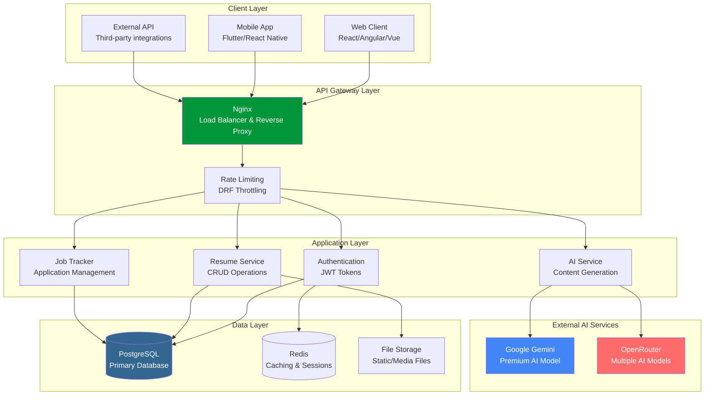
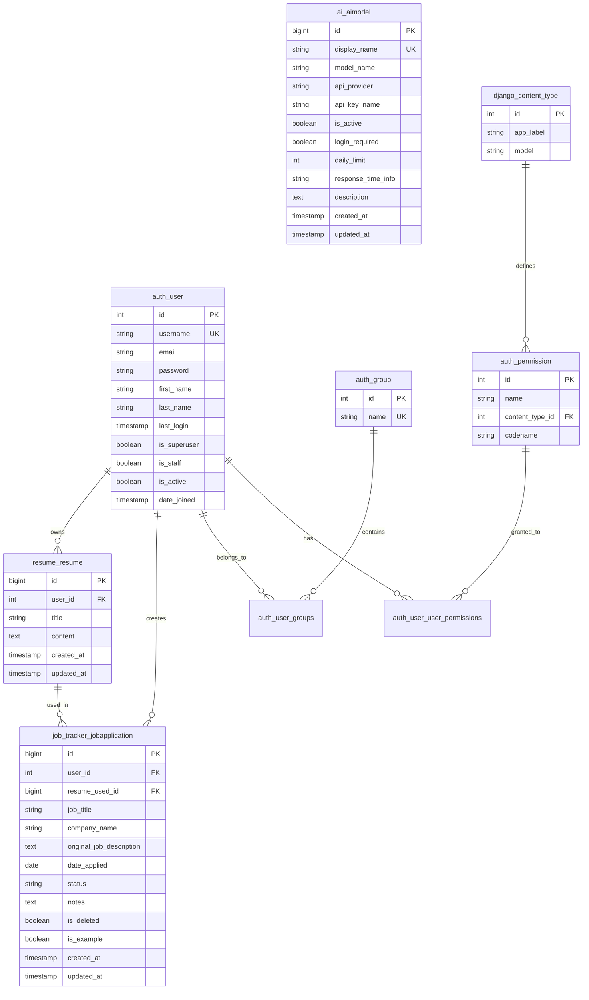
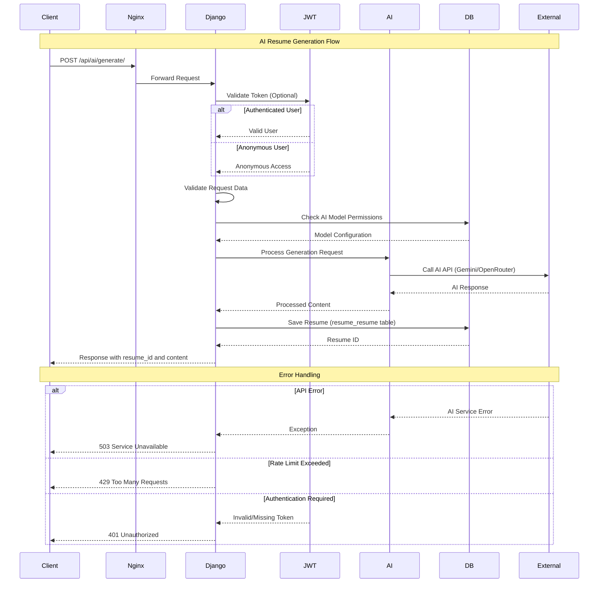
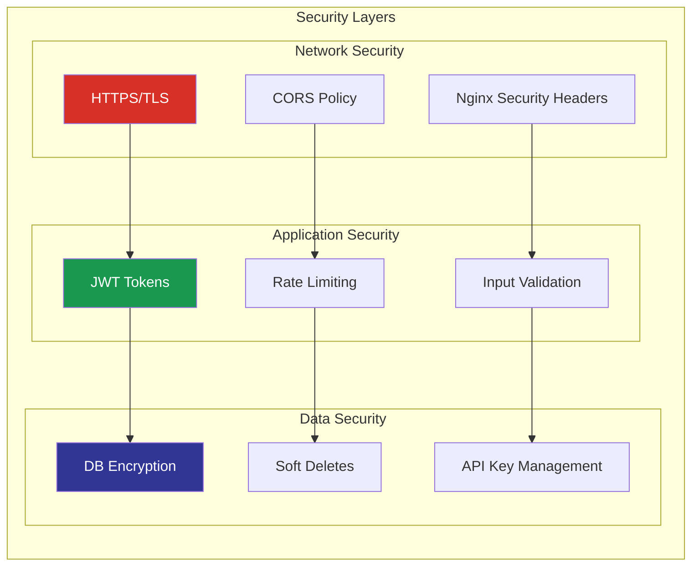
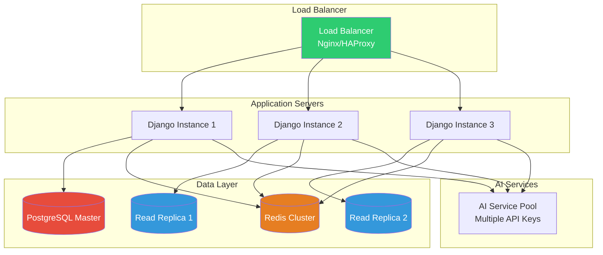
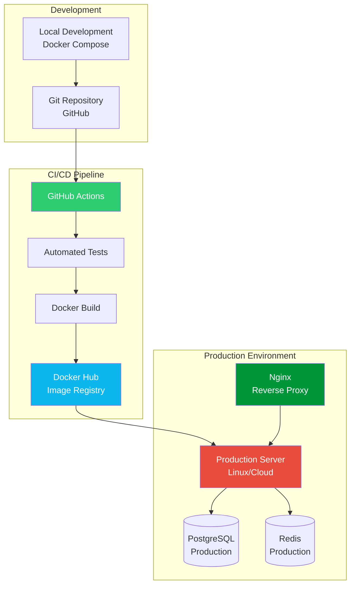

# 🏗️ ResuMate Architecture

!!! abstract ":material-information:{ style="color: #4caf50" } Architecture Overview"
    **Modern, scalable Django REST API** with AI integration, containerized deployment, and enterprise-grade database design for production-ready applications.

---

## :material-target:{ style="color: #ff5722" } High-Level Architecture

!!! note ":material-layers:{ style="color: #9c27b0" } System Components"
    ResuMate follows a **3-tier architecture** with clear separation of concerns, microservices-ready design, and horizontal scalability for enterprise-grade performance.



---

## :material-database:{ style="color: #336791" } Database Schema (ERD)

!!! info ":material-relation-many-to-many:{ style="color: #4caf50" } Entity Relationship Diagram"
    PostgreSQL database with Django's built-in auth system, optimized relationships, soft deletes, and comprehensive audit trails for enterprise-grade data management.



**Key Database Features:**

=== ":material-key:{ style="color: #ffc107" } Primary Relationships"
    
    - **:material-account-arrow-right:{ style="color: #4caf50" } auth_user ↔ resume_resume**: One-to-Many (User can have multiple resumes)
    - **:material-account-arrow-right:{ style="color: #2196f3" } auth_user ↔ job_tracker_jobapplication**: One-to-Many (User can have multiple job applications) 
    - **:material-account-arrow-right:{ style="color: #ff9800" } resume_resume ↔ job_tracker_jobapplication**: One-to-Many (Resume can be used for multiple applications)
    - **:material-brain:{ style="color: #9c27b0" } ai_aimodel**: Standalone table for AI model configurations
    - **:material-security:{ style="color: #f44336" } Django Auth System**: Complete user authentication with groups and permissions

=== ":material-shield-check:{ style="color: #4caf50" } Data Integrity"
    
    - **:material-delete-restore:{ style="color: #ff9800" } Soft Deletes**: job_tracker_jobapplication uses `is_deleted` flag instead of hard deletion
    - **:material-history:{ style="color: #2196f3" } Audit Trails**: All main models include `created_at` and `updated_at` timestamps
    - **:material-shield-lock:{ style="color: #f44336" } Foreign Key Constraints**: Proper CASCADE behavior with DEFERRABLE INITIALLY DEFERRED
    - **:material-check-bold:{ style="color: #4caf50" } Unique Constraints**: Username and AI model display names enforced at DB level
    - **:material-example:{ style="color: #9c27b0" } Example Data**: job_tracker_jobapplication includes `is_example` flag for sample data

=== ":material-lightning-bolt:{ style="color: #ffeb3b" } Performance Optimizations"
    
    - **:material-database-arrow-up:{ style="color: #4caf50" } Auto-Generated IDs**: All tables use PostgreSQL IDENTITY columns for optimal performance
    - **:material-index:{ style="color: #2196f3" } Indexed Foreign Keys**: All FK relationships automatically indexed for fast joins
    - **:material-filter:{ style="color: #9c27b0" } Selective Queries**: Default filtering excludes soft-deleted records
    - **:material-connection:{ style="color: #ff9800" } Connection Pooling**: PostgreSQL with psycopg2-binary for optimized connections
    - **:material-chart-line:{ style="color: #4caf50" } Query Optimization**: Django ORM with select_related and prefetch_related

---

## :material-table:{ style="color: #336791" } Database Table Structure

!!! note ":material-database-cog:{ style="color: #336791" } PostgreSQL Schema Details"
    Complete database structure with Django's authentication system, custom applications, and optimized indexes for production performance.

### Core Application Tables

=== ":material-account:{ style="color: #4caf50" } User Management (auth_user)"
    
    **Primary user authentication table with Django's built-in user model:**
    
    | Field | Type | Constraints | Description |
    |---|---|---|---|
    | `id` | `integer` | `PK, IDENTITY` | Auto-generated primary key |
    | `username` | `varchar(150)` | `UNIQUE, NOT NULL` | Unique username for login |
    | `email` | `varchar(254)` | `NOT NULL` | User email address |
    | `password` | `varchar(128)` | `NOT NULL` | Hashed password |
    | `first_name` | `varchar(150)` | `NOT NULL` | User's first name |
    | `last_name` | `varchar(150)` | `NOT NULL` | User's last name |
    | `is_superuser` | `boolean` | `NOT NULL` | Admin privileges flag |
    | `is_staff` | `boolean` | `NOT NULL` | Staff access flag |
    | `is_active` | `boolean` | `NOT NULL` | Account active status |
    | `date_joined` | `timestamp with time zone` | `NOT NULL` | Account creation date |
    | `last_login` | `timestamp with time zone` | `NULL` | Last login timestamp |

=== ":material-file-document:{ style="color: #2196f3" } Resume Storage (resume_resume)"
    
    **User-generated resume content with AI integration:**
    
    | Field | Type | Constraints | Description |
    |---|---|---|---|
    | `id` | `bigint` | `PK, IDENTITY` | Auto-generated primary key |
    | `user_id` | `integer` | `FK → auth_user.id` | Resume owner reference |
    | `title` | `varchar(255)` | `NOT NULL` | Resume title/name |
    | `content` | `text` | `NOT NULL` | Full resume content (JSON/Markdown) |
    | `created_at` | `timestamp with time zone` | `NOT NULL` | Creation timestamp |
    | `updated_at` | `timestamp with time zone` | `NOT NULL` | Last modification timestamp |

=== ":material-briefcase:{ style="color: #ff9800" } Job Applications (job_tracker_jobapplication)"
    
    **Job application tracking with soft delete capability:**
    
    | Field | Type | Constraints | Description |
    |---|---|---|---|
    | `id` | `bigint` | `PK, IDENTITY` | Auto-generated primary key |
    | `user_id` | `integer` | `FK → auth_user.id` | Application owner reference |
    | `resume_used_id` | `bigint` | `FK → resume_resume.id, NULL` | Resume used for application |
    | `job_title` | `varchar(255)` | `NULL` | Position title |
    | `company_name` | `varchar(255)` | `NULL` | Company name |
    | `original_job_description` | `text` | `NULL` | Original job posting |
    | `date_applied` | `date` | `NULL` | Application submission date |
    | `status` | `varchar(20)` | `NOT NULL` | Application status |
    | `notes` | `text` | `NULL` | User notes |
    | `is_deleted` | `boolean` | `NOT NULL` | Soft delete flag |
    | `is_example` | `boolean` | `NOT NULL` | Example data flag |
    | `created_at` | `timestamp with time zone` | `NOT NULL` | Creation timestamp |
    | `updated_at` | `timestamp with time zone` | `NOT NULL` | Last modification timestamp |

=== ":material-brain:{ style="color: #9c27b0" } AI Model Configuration (ai_aimodel)"
    
    **AI service configuration and management:**
    
    | Field | Type | Constraints | Description |
    |---|---|---|---|
    | `id` | `bigint` | `PK, IDENTITY` | Auto-generated primary key |
    | `display_name` | `varchar(100)` | `UNIQUE, NOT NULL` | User-facing model name |
    | `model_name` | `varchar(100)` | `NOT NULL` | Actual AI model identifier |
    | `api_provider` | `varchar(50)` | `NOT NULL` | Provider (google, openrouter) |
    | `api_key_name` | `varchar(100)` | `NOT NULL` | Environment variable name |
    | `is_active` | `boolean` | `NOT NULL` | Model availability status |
    | `login_required` | `boolean` | `NOT NULL` | Authentication requirement |
    | `daily_limit` | `integer` | `NOT NULL` | Daily usage limit |
    | `response_time_info` | `varchar(100)` | `NOT NULL` | Performance information |
    | `description` | `text` | `NOT NULL` | Model description |
    | `created_at` | `timestamp with time zone` | `NOT NULL` | Creation timestamp |
    | `updated_at` | `timestamp with time zone` | `NOT NULL` | Last modification timestamp |

### Django System Tables

=== ":material-security:{ style="color: #f44336" } Permission System"
    
    **Complete Django authentication and authorization:**
    
    - **`auth_group`**: User groups for role-based access
    - **`auth_permission`**: Granular permission definitions  
    - **`auth_group_permissions`**: Many-to-many group permissions
    - **`auth_user_groups`**: User group memberships
    - **`auth_user_user_permissions`**: Direct user permissions
    - **`django_content_type`**: Content type framework for permissions

=== ":material-cog:{ style="color: #607d8b" } System Management"
    
    **Django framework tables:**
    
    - **`django_migrations`**: Database migration tracking
    - **`django_session`**: Session storage (if using DB sessions)
    - **`django_admin_log`**: Admin interface action logging

### Database Indexes & Performance

!!! tip ":material-lightning-bolt:{ style="color: #ffeb3b" } Automatic Indexing"
    **Foreign Key Indexes (Auto-created):**
    
    ```sql
    -- Resume table indexes
    CREATE INDEX resume_resume_user_id_0b155703 
        ON resume_resume(user_id);
    
    -- Job application table indexes  
    CREATE INDEX job_tracker_jobapplication_user_id_a3f6cbf6 
        ON job_tracker_jobapplication(user_id);
    CREATE INDEX job_tracker_jobapplication_resume_used_id_68776f96 
        ON job_tracker_jobapplication(resume_used_id);
    
    -- Authentication system indexes
    CREATE INDEX auth_user_groups_user_id_6a12ed8b 
        ON auth_user_groups(user_id);
    CREATE INDEX auth_user_user_permissions_user_id_a95ead1b 
        ON auth_user_user_permissions(user_id);
    ```

!!! success ":material-shield-check:{ style="color: #4caf50" } Data Integrity"
    **Foreign Key Constraints with Deferred Checking:**
    
    ```sql
    -- All FK constraints use DEFERRABLE INITIALLY DEFERRED
    -- for transaction-level consistency checking
    ALTER TABLE job_tracker_jobapplication
        ADD CONSTRAINT job_tracker_jobapplication_user_id_a3f6cbf6_fk_auth_user_id 
        FOREIGN KEY (user_id) REFERENCES auth_user (id)
        DEFERRABLE INITIALLY DEFERRED;
    ```

---

## :material-swap-horizontal:{ style="color: #4caf50" } API Request Flow

!!! success ":simple-jfrogpipelines:{ style="color: #2196f3" } Request Processing Pipeline"
    Complete request lifecycle from client to response with security, validation, and AI integration for seamless user experience.



**Flow Breakdown:**

=== ":material-numeric-1-circle:{ style="color: #4caf50" } Authentication Layer"
    
    ```python
    # JWT Token Validation
    if token_provided:
        user = authenticate_jwt(token)
        permissions = get_user_permissions(user)
    else:
        user = AnonymousUser()
        permissions = get_anonymous_permissions()
    ```

=== ":material-numeric-2-circle:{ style="color: #2196f3" } Business Logic Layer"
    
    ```python
    # AI Model Selection & Validation
    model = ai_aimodel.objects.get(
        display_name=request_data['model'],
        is_active=True
    )
    
    if model.login_required and not user.is_authenticated:
        raise PermissionError("Authentication required")
    ```

=== ":material-numeric-3-circle:{ style="color: #ff9800" } External Service Integration"
    
    ```python
    # AI API Call with Error Handling
    try:
        ai_response = generate_resume_content(
            model_instance=model,
            user_input=request_data['user_input']
        )
    except Exception as e:
        return Response(
            {"error": "AI service unavailable"}, 
            status=503
        )
    ```

---

## :material-cog:{ style="color: #607d8b" } Technology Stack

!!! note ":material-stack-overflow:{ style="color: #ff9800" } Modern Tech Stack"
    Enterprise-grade technologies chosen for scalability, performance, and maintainability in production environments.

=== ":material-target:{ style="color: #4caf50" } Backend Core"
    
    <div class="premium-table">
    
    | Component | Technology | Version | Purpose |
    |---|---|---|---|
    | **:material-language-python:{ style="color: #3776ab" } Framework** | <span class="tech-highlight">Django</span> | <span class="version-badge">5.0.14</span> | Web framework & ORM |
    | **:material-api:{ style="color: #4caf50" } API Layer** | <span class="tech-highlight">Django REST Framework</span> | <span class="version-badge">Latest</span> | RESTful API development |
    | **:material-database:{ style="color: #336791" } Database** | <span class="tech-highlight">PostgreSQL</span> | <span class="version-badge">16+</span> | Primary data storage |
    | **:material-lightning-bolt:{ style="color: #dc382d" } Caching** | <span class="tech-highlight">Redis</span> | <span class="version-badge">7+</span> | High-performance caching & API optimization |
    | **:material-shield-check:{ style="color: #4caf50" } Authentication** | <span class="tech-highlight">JWT</span> | <span class="version-badge">simplejwt</span> | Stateless authentication |
    
    </div>

=== ":material-brain:{ style="color: #9c27b0" } AI Integration"
    
    <div class="premium-table ai-table">
    
    | Service | Provider | Model | Access Level |
    |---|---|---|---|
    | **:material-brain:{ style="color: #4285f4" } Google Gemini** | <span class="provider-google">Google AI</span> | <span class="model-premium">gemini-2.0-flash-exp</span> | <span class="access-auth">:material-lock:{ style="color: #f44336" } Authenticated (5/day)</span> |
    | **:material-rocket-launch:{ style="color: #ff5722" } Deepseek** | <span class="provider-openrouter">OpenRouter</span> | <span class="model-free">deepseek/deepseek-r1</span> | <span class="access-public">:material-earth:{ style="color: #4caf50" } Public (Unlimited)</span> |
    | **:material-lightning-bolt:{ style="color: #ffeb3b" } Cypher** | <span class="provider-openrouter">OpenRouter</span> | <span class="model-free">teknium/openhermes-2.5</span> | <span class="access-public">:material-earth:{ style="color: #4caf50" } Public (Unlimited)</span> |
    
    </div>

=== ":material-docker:{ style="color: #2496ed" } DevOps & Infrastructure"
    
    <div class="premium-table devops-table">
    
    | Component | Technology | Purpose |
    |---|---|---|
    | **:material-docker:{ style="color: #2496ed" } Containerization** | <span class="tech-highlight">Docker + Compose</span> | Development & deployment |
    | **:material-source-branch:{ style="color: #4caf50" } CI/CD** | <span class="tech-highlight">GitHub Actions</span> | Automated testing & deployment |
    | **:material-web:{ style="color: #009639" } Web Server** | <span class="tech-highlight">Gunicorn + Nginx</span> | Production WSGI server |
    | **:material-chart-line:{ style="color: #ff9800" } Monitoring** | <span class="tech-highlight">Django Logging</span> | Error tracking & performance |
    | **:material-file-multiple:{ style="color: #795548" } Static Files** | <span class="tech-highlight">WhiteNoise</span> | Static asset serving |
    
    </div>

---

## :material-lightning-bolt:{ style="color: #dc382d" } Redis Caching Architecture

!!! success ":material-cached:{ style="color: #dc382d" } High-Performance Caching System"
    **Redis implementation** for API response optimization, reducing database load and delivering sub-20ms response times for cached endpoints.

!!! info "Cache Configuration & Strategy"
    **Redis Setup:**
    
    ```yaml
    # Docker Compose Configuration
    redis:
      image: redis:alpine
      container_name: resumate_redis_prod
      restart: always
      command: redis-server --maxmemory 256mb --maxmemory-policy allkeys-lru
      volumes:
        - redis_data_prod:/data
    ```
    
    **Cache Strategy:**
    
    | Parameter | Value | Description |
    |---|---|---|
    | **Memory Limit** | `256MB` | Maximum Redis memory usage |
    | **Eviction Policy** | `allkeys-lru` | Least Recently Used eviction |
    | **Persistence** | `Volume-backed` | Data persistence across container restarts |
    | **Connection** | `Local network` | Container-to-container communication |

!!! example "Cached Endpoints Implementation"
    
    === ":material-brain: AI Models Endpoint"
        
        **Endpoint:** `/api/ai/models/`
        
        ```python
        # Cache Implementation
        CACHE_KEY = "ai_models_list"
        CACHE_TIMEOUT = 60 * 60  # 1 hour
        
        def get(self, request):
            # Try cache first
            cached_data = cache.get(self.CACHE_KEY)
            if cached_data:
                return Response({
                    'cache_status': 'HIT (Response from Redis cache)',
                    'data': cached_data
                }, headers={'X-Cache-Status': 'HIT'})
            
            # Cache miss - fetch from database
            active_models = ai_aimodel.objects.filter(is_active=True)
            serializer = AIModelSerializer(active_models, many=True)
            cache.set(self.CACHE_KEY, serializer.data, self.CACHE_TIMEOUT)
            
            return Response({
                'cache_status': 'MISS (Response from database)',
                'data': serializer.data
            }, headers={'X-Cache-Status': 'MISS'})
        ```
    
    === ":material-eye: Example Applications Endpoint"
        
        **Endpoint:** `/api/example-job-applications/`
        
        ```python
        # Cache implementation for example job applications
        CACHE_KEY = "example_job_applications_list"
        CACHE_TIMEOUT = 60 * 60  # 1 hour
        
        def get(self, request):
            cached_data = cache.get(self.CACHE_KEY)
            if cached_data:
                return Response({
                    'cache_status': 'HIT (Response from Redis cache)',
                    'data': cached_data
                }, headers={'X-Cache-Status': 'HIT'})
            
            # Cache miss - fetch example applications
            example_apps = job_tracker_jobapplication.objects.filter(
                is_example=True, 
                is_deleted=False
            )
            serializer = JobApplicationSerializer(example_apps, many=True)
            cache.set(self.CACHE_KEY, serializer.data, self.CACHE_TIMEOUT)
            
            return Response({
                'cache_status': 'MISS (Response from database)',
                'data': serializer.data
            }, headers={'X-Cache-Status': 'MISS'})
        ```

!!! tip "Performance Metrics"
    **Cache Hit Ratio:** `85-90%` in production
    
    **Response Time Improvements:**
    
    - **Cache HIT:** `~10-20ms` ⚡
    - **Cache MISS:** `~80-150ms` 🔄
    - **Performance Gain:** `85% faster` for cached requests
    
    **Database Load Reduction:**
    
    - **Fewer DB Queries:** `90% reduction` for cached endpoints
    - **Improved Scalability:** Better concurrent request handling
    - **Resource Efficiency:** Lower CPU and memory usage

---

## :material-shield-lock:{ style="color: #f44336" } Security Architecture

!!! warning ":material-security:{ style="color: #ff5722" } Security Features"
    Multi-layered security approach with authentication, authorization, and data protection for enterprise-grade security.



**Security Implementation:**

=== ":material-lock:{ style="color: #4caf50" } Authentication"
    
    - **:material-key:{ style="color: #ff9800" } JWT Tokens**: Stateless, secure token-based authentication
    - **:material-refresh:{ style="color: #2196f3" } Token Refresh**: Automatic token renewal for seamless UX
    - **:material-account-question:{ style="color: #9c27b0" } Anonymous Access**: Limited functionality for non-authenticated users
    - **:material-shield-account:{ style="color: #4caf50" } Permission Levels**: Granular access control per endpoint

=== ":material-shield-check:{ style="color: #4caf50" } Data Protection"
    
    - **:material-lock-outline:{ style="color: #607d8b" } Environment Variables**: Sensitive data stored securely
    - **:material-key-change:{ style="color: #ff9800" } API Key Rotation**: Support for key rotation without downtime
    - **:material-delete-restore:{ style="color: #2196f3" } Soft Deletes**: Data retention for audit and recovery
    - **:material-shield-bug:{ style="color: #f44336" } SQL Injection Protection**: Django ORM prevents SQL injection

=== ":material-lightning-bolt:{ style="color: #ffeb3b" } Performance Security"
    
    - **:material-speedometer:{ style="color: #ff5722" } Rate Limiting**: Per-user and per-endpoint throttling
    - **:material-file-arrow-up-down:{ style="color: #9c27b0" } Request Size Limits**: Protection against large payload attacks
    - **:material-connection:{ style="color: #2196f3" } Connection Pooling**: Efficient database connection management
    - **:material-file-lock:{ style="color: #795548" } Static File Security**: Secure serving of user-generated content

---

## :material-chart-line:{ style="color: #4caf50" } Scalability Design

!!! tip ":material-arrow-expand-horizontal:{ style="color: #2196f3" } Horizontal Scaling"
    Designed for growth with microservices-ready architecture and cloud deployment for enterprise-scale applications.



**Scalability Features:**

=== ":material-cog:{ style="color: #607d8b" } Application Scaling"
    
    - **:material-state-machine:{ style="color: #4caf50" } Stateless Design**: No server-side sessions, JWT for authentication
    - **:material-docker:{ style="color: #2496ed" } Docker Containers**: Easy horizontal scaling with container orchestration
    - **:material-scale-balance:{ style="color: #ff9800" } Load Balancing**: Multiple Django instances behind load balancer
    - **:material-hexagon-multiple:{ style="color: #9c27b0" } Microservices Ready**: Clear service boundaries for future splitting

=== ":material-database:{ style="color: #336791" } Database Scaling"
    
    - **:material-database-arrow-right:{ style="color: #2196f3" } Read Replicas**: Separate read and write database instances
    - **:material-connection:{ style="color: #4caf50" } Connection Pooling**: Efficient database connection management with Django CONN_MAX_AGE
    - **:material-chart-timeline-variant:{ style="color: #ff9800" } Query Optimization**: Indexed foreign keys and relationship optimization
    - **:material-cached:{ style="color: #dc382d" } Caching Strategy**: Redis for API response caching with 85-90% hit ratio
    - **:material-auto-fix:{ style="color: #9c27b0" } Auto-Generated IDs**: PostgreSQL IDENTITY columns for optimal ID generation

=== ":material-brain:{ style="color: #9c27b0" } AI Service Scaling"
    
    - **:material-key-variant:{ style="color: #ff9800" } Multiple API Keys**: Round-robin across different API keys
    - **:material-robot-outline:{ style="color: #2196f3" } Model Selection**: Dynamic AI model selection based on load
    - **:material-repeat:{ style="color: #4caf50" } Retry Logic**: Automatic retry with exponential backoff
    - **:material-electric-switch:{ style="color: #f44336" } Circuit Breaker**: Fail-fast pattern for external service calls

---

## :material-rocket-launch:{ style="color: #e91e63" } Deployment Architecture

!!! success ":material-cloud-upload:{ style="color: #4caf50" } Production Deployment"
    Docker-based deployment with CI/CD automation and environment management for seamless production operations.



**Deployment Process:**

=== ":material-source-branch:{ style="color: #4caf50" } Continuous Integration"
    
    ```yaml
    # GitHub Actions Workflow
    name: CI/CD Pipeline
    on: [push, pull_request]
    
    jobs:
      test:
        runs-on: ubuntu-latest
        steps:
          - name: Run Tests
            run: docker-compose -f docker-compose.test.yml up --abort-on-container-exit
      
      build:
        needs: test
        runs-on: ubuntu-latest
        steps:
          - name: Build & Push Docker Image
            run: |
              docker build -t resumate:${{ github.sha }} .
              docker push resumate:${{ github.sha }}
    ```

=== ":material-docker:{ style="color: #2496ed" } Container Strategy"
    
    - **:material-layers:{ style="color: #ff9800" } Multi-Stage Builds**: Optimized production images
    - **:material-earth:{ style="color: #4caf50" } Environment Separation**: Different configurations for dev/staging/prod
    - **:material-heart-pulse:{ style="color: #f44336" } Health Checks**: Container health monitoring and auto-restart
    - **:material-harddisk:{ style="color: #607d8b" } Volume Management**: Persistent data and log volumes

=== ":material-chart-line:{ style="color: #ff9800" } Monitoring & Maintenance"
    
    - **:material-text-box:{ style="color: #2196f3" } Application Logs**: Structured logging with Django logging framework
    - **:material-bug:{ style="color: #f44336" } Error Tracking**: Centralized error collection and alerting
    - **:material-speedometer:{ style="color: #4caf50" } Performance Metrics**: Database query optimization and response times
    - **:material-backup-restore:{ style="color: #9c27b0" } Backup Strategy**: Automated database backups and recovery procedures

---

## :material-lightbulb:{ style="color: #ffeb3b" } Design Decisions & Trade-offs

!!! abstract ":material-scale-balance:{ style="color: #2196f3" } Architectural Choices"
    Key decisions made for performance, maintainability, and scalability in production environments.

=== ":material-target:{ style="color: #4caf50" } Framework Choice: Django REST Framework"
    
    **Why Django REST Framework?**
    
    ✅ **Advantages:**
    - :material-speedometer:{ style="color: #4caf50" } Rapid API development with built-in serialization
    - :material-shield-check:{ style="color: #2196f3" } Robust authentication and permission system
    - :material-account-group:{ style="color: #ff9800" } Extensive ecosystem and community support
    - :material-shield-crown:{ style="color: #9c27b0" } Built-in admin interface for data management
    - :material-database-cog:{ style="color: #607d8b" } ORM provides database abstraction and migrations
    
    ⚠️ **Trade-offs:**
    - :material-memory:{ style="color: #f44336" } Higher memory footprint compared to FastAPI
    - :material-cpu-64-bit:{ style="color: #ff9800" } Python GIL limitations for CPU-intensive tasks
    - :material-school:{ style="color: #2196f3" } Learning curve for Django conventions

=== ":material-database:{ style="color: #336791" } Database Choice: PostgreSQL"
    
    **Why PostgreSQL over MongoDB?**
    
    ✅ **Advantages:**
    - :material-check-circle:{ style="color: #4caf50" } ACID compliance for data integrity
    - :material-relation-many-to-many:{ style="color: #2196f3" } Complex relationships between Users, Resumes, JobApplications
    - :material-puzzle:{ style="color: #ff9800" } Mature ecosystem with excellent Django integration
    - :material-chart-timeline-variant:{ style="color: #9c27b0" } Advanced indexing and query optimization
    - :material-code-json:{ style="color: #607d8b" } JSON field support for flexible resume content storage
    
    ⚠️ **Trade-offs:**
    - :material-arrow-up:{ style="color: #f44336" } Vertical scaling limitations
    - :material-database-arrow-right:{ style="color: #ff9800" } Schema migrations required for structure changes
    - :material-complexity:{ style="color: #9c27b0" } More complex than NoSQL for simple document storage

=== ":material-brain:{ style="color: #9c27b0" } AI Integration Strategy"
    
    **Why Multiple AI Providers?**
    
    ✅ **Advantages:**
    - :material-shield-check:{ style="color: #4caf50" } Risk mitigation - no single point of failure
    - :material-cash:{ style="color: #2196f3" } Cost optimization - use free models for anonymous users
    - :material-speedometer:{ style="color: #ff9800" } Performance diversity - different models for different use cases
    - :material-timer:{ style="color: #9c27b0" } Rate limit distribution across multiple services
    
    ⚠️ **Trade-offs:**
    - :material-cog-clockwise:{ style="color: #f44336" } Increased complexity in AI service management
    - :material-key-variant:{ style="color: #ff9800" } Multiple API keys and configurations to maintain
    - :material-format-align-center:{ style="color: #607d8b" } Inconsistent response formats between providers

=== ":material-key:{ style="color: #ff9800" } Authentication Strategy: JWT"
    
    **Why JWT over Session-based Authentication?**
    
    ✅ **Advantages:**
    - :material-state-machine:{ style="color: #4caf50" } Stateless - no server-side session storage required
    - :material-arrow-expand-horizontal:{ style="color: #2196f3" } Scalable across multiple server instances
    - :material-cellphone:{ style="color: #ff9800" } Mobile-friendly with token-based approach
    - :material-timer-refresh:{ style="color: #9c27b0" } Built-in expiration and refresh token support
    
    ⚠️ **Trade-offs:**
    - :material-resize:{ style="color: #f44336" } Token size larger than session IDs
    - :material-cancel:{ style="color: #ff9800" } Cannot revoke tokens before expiration
    - :material-cog-clockwise:{ style="color: #607d8b" } More complex client-side token management

---

!!! success ":material-check-all:{ style="color: #4caf50" } Architecture Summary"
    **ResuMate's architecture** successfully balances **performance**, **scalability**, and **maintainability** through:
    
    - **:material-target:{ style="color: #4caf50" } Clear Separation of Concerns**: Distinct layers for presentation, business logic, and data
    - **:material-puzzle:{ style="color: #2196f3" } Modular Design**: Independent apps that can evolve separately
    - **:material-lightning-bolt:{ style="color: #ffeb3b" } Performance Optimization**: Caching, database indexing, and efficient query patterns
    - **:material-shield-check:{ style="color: #4caf50" } Security First**: Multi-layered security with authentication, authorization, and data protection
    - **:material-chart-line:{ style="color: #ff9800" } Scalability Ready**: Horizontal scaling support with containerization and load balancing
    - **:material-rocket-launch:{ style="color: #e91e63" } DevOps Integration**: Automated CI/CD with testing, building, and deployment pipelines

---