# 🚀 CI/CD Pipeline

!!! success "Production-Ready DevOps"
    **Automated deployment pipeline** for ResuMate Django application featuring GitHub Actions, Docker containerization, and DigitalOcean cloud infrastructure with SSL/TLS security.

**Pipeline Features:** :material-github:{ style="color: #24292e" } GitHub Actions • :material-docker:{ style="color: #2496ed" } Docker Containerization • :material-cloud:{ style="color: #0080ff" } DigitalOcean Droplet • :material-shield-check:{ style="color: #4caf50" } SSL/TLS Security

!!! tip "Live Production System"
    The pipeline automatically deploys to: [https://arafat2.me](https://arafat2.me) • [API Endpoint](https://arafat2.me/api/) • [Admin Panel](https://arafat2.me/admin/)

---

## 🏗️ Architecture Overview

```mermaid
graph TD
    A["👨‍💻 Developer"] -->|git push| B["📦 GitHub Repository"]
    B -->|Trigger| C["🔄 GitHub Actions"]
    
    C --> D["🏗️ Build Stage"]
    D --> E["📦 Docker Build"]
    E --> F["📤 Push to Docker Hub"]
    
    F --> G["🚀 Deploy Stage"]
    G --> H["🔐 SSH to DigitalOcean"]
    H --> I["⬇️ Pull Latest Image"]
    I --> J["🐳 Docker Compose Up"]
    
    J --> K["🌐 Nginx Reverse Proxy"]
    K --> L["🔒 SSL/TLS Termination"]
    L --> M["🎯 Production Site"]
    
    N["🗄️ PostgreSQL Database"] --> J
```



### 🔧 Infrastructure Components

!!! info "Production Infrastructure Stack"
    Complete overview of our production-grade infrastructure components powering the ResuMate application.

| Component | Technology | Purpose | Status |
|-----------|------------|---------|--------|
| ☁️ **Cloud Provider** | `DigitalOcean Droplet` | Ubuntu 22.04 LTS server hosting | ✅ **Active** |
| 🌐 **Web Server** | `Nginx` | Reverse proxy & SSL termination | ✅ **Active** |
| 🐳 **Container Runtime** | `Docker & Docker Compose` | Application containerization | ✅ **Active** |
| 🗄️ **Database** | `PostgreSQL 16` | Primary data persistence | ✅ **Active** |
| 📦 **Registry** | `Docker Hub` | Container image storage | ✅ **Active** |
| 🔐 **SSL Certificate** | `Let's Encrypt` | Free SSL/TLS encryption | ✅ **Active** |

---

## 🔄 GitHub Actions Workflow

### 📋 Build & Deploy Process

!!! example "Automated CI/CD Pipeline"
    **Triggers:** Every push to `master` branch • **Duration:** ~5 minutes • **Zero Downtime:** ✅

!!! note "Build Stage"
    **Docker Image Creation and Registry Push**
    
    ```yaml
    - name: Build and push Docker image
      uses: docker/build-push-action@v5
      with:
        context: .
        push: true
        tags: arafat6462/resumate:master
    ```

!!! success "Deploy Stage" 
    **Production Server Deployment**
    
    ```bash
    # SSH to production server
    ssh root@arafat2.me

    # Pull latest image and deploy
    docker pull arafat6462/resumate:master
    IMAGE_TAG=master docker compose -f docker-compose.prod.yml up -d

    # Cleanup old images
    docker image prune -f
    ```

### 🔒 Security & Secrets

!!! warning "Sensitive Configuration"
    All sensitive data is securely managed through GitHub Secrets with proper encryption and access controls.

| Secret Variable | Purpose | Type |
|-----------------|---------|------|
| `DOCKER_HUB_USERNAME` | Docker Hub authentication | Registry |
| `DOCKER_HUB_TOKEN` | Docker Hub access token | Registry |
| `DROPLET_HOST` | Production server IP | Server |
| `DROPLET_SSH_KEY` | Private SSH key | Authentication |
| `DB_PASSWORD` | Database password | Database |
| `SECRET_KEY` | Django secret key | Application |
| `GEMINI_API_KEY` | Google AI API key | External API |

---

## 🐳 Docker Configuration

### 📦 Production Setup

!!! tip "Container Configuration"
    Optimized Docker setup for production deployment with health checks and automatic restarts.

!!! info "Application Container"
    **Multi-stage Docker build for optimized production image**
    
    ```dockerfile
    FROM python:3.11-slim-buster
    WORKDIR /app
    COPY requirements.txt .
    RUN pip install --no-cache-dir -r requirements.txt
    COPY . .
    RUN python manage.py collectstatic --noinput
    EXPOSE 8000
    CMD ["/app/entrypoint.sh"]
    ```

!!! success "Docker Compose Production"
    **Service orchestration with health monitoring**
    
    ```yaml
    services:
      backend:
        image: arafat6462/resumate:${IMAGE_TAG:-latest}
        restart: always
        ports:
          - "8000:8000"
        depends_on:
          db:
            condition: service_healthy

      db:
        image: postgres:16
        restart: always
        healthcheck:
          test: ["CMD-SHELL", "pg_isready -U ${DB_USER} -d ${DB_NAME}"]
          interval: 5s
          timeout: 5s
          retries: 5
    ```

---

## 🌐 Nginx & SSL Configuration

### 🔒 Production Web Server

!!! abstract "HTTPS & Security Configuration"
    Enterprise-grade web server configuration with SSL/TLS encryption and security headers.

!!! example "HTTPS Configuration"
    **Nginx reverse proxy with SSL termination**
    
    ```nginx
    server {
        server_name arafat2.me www.arafat2.me;

        location / {
            proxy_pass http://127.0.0.1:8000;
            proxy_set_header Host $host;
            proxy_set_header X-Real-IP $remote_addr;
            proxy_set_header X-Forwarded-For $proxy_add_x_forwarded_for;
            proxy_set_header X-Forwarded-Proto $scheme;
        }

        listen 443 ssl;
        ssl_certificate /etc/letsencrypt/live/arafat2.me/fullchain.pem;
        ssl_certificate_key /etc/letsencrypt/live/arafat2.me/privkey.pem;
    }

    # HTTP to HTTPS redirect
    server {
        listen 80;
        server_name arafat2.me www.arafat2.me;
        return 301 https://$host$request_uri;
    }
    ```

---

## 📊 Deployment Timeline


### 📋 Deployment Checklist

!!! success "Automated Deployment Stages"
    Complete deployment pipeline with automated checks and validations at each stage.

| Stage | Check | Status | Duration |
|-------|-------|--------|----------|
| 🏗️ **Build** | Docker image creation | ✅ **Automated** | ~3 min |
| 📤 **Push** | Registry upload | ✅ **Automated** | ~1 min |
| 🔐 **Auth** | Server SSH connection | ✅ **Automated** | ~10 sec |
| 📥 **Pull** | Latest image download | ✅ **Automated** | ~1 min |
| 🐳 **Deploy** | Container orchestration | ✅ **Automated** | ~30 sec |
| 🎯 **Health** | Service availability | ✅ **Automated** | ~20 sec |

---

## 🔧 Key Features

### ⚡ Production Highlights

!!! tip "Enterprise-Grade Features"
    Production-ready deployment pipeline with industry best practices and security standards.

| Feature | Implementation | Benefit |
|---------|----------------|---------|
| 🔄 **Zero Downtime** | `Rolling Updates` | Seamless deployments |
| 🛡️ **Health Checks** | `PostgreSQL + App` | Automatic failure detection |
| 🔒 **SSL/TLS** | `Let's Encrypt` | Secure HTTPS traffic |
| 📦 **Auto Cleanup** | `Docker Prune` | Optimized disk usage |
| 🔐 **Secrets Management** | `GitHub Secrets` | Secure credential storage |
| 🌐 **Reverse Proxy** | `Nginx` | Load balancing & caching |

### 📈 Quick Commands

!!! info "Management Commands"
    Essential commands for monitoring and managing the production environment.

| Purpose | Command | Description |
|---------|---------|-------------|
| 🔍 **Status** | `docker ps -a` | View containers |
| 📊 **Logs** | `docker logs -f resumate_backend_prod` | Application logs |
| 🔄 **Restart** | `docker-compose restart` | Restart services |
| 🧹 **Cleanup** | `docker system prune -f` | Remove unused resources |
| 🌐 **Nginx** | `sudo nginx -t && sudo systemctl reload nginx` | Test & reload config |
| 🔒 **SSL** | `certbot certificates` | Check certificate status |

---

!!! success "Production-Ready Pipeline"
    :material-rocket:{ style="color: #ff9800" } **Fully Automated** deployment with zero-downtime updates, SSL security, and comprehensive monitoring.

    **Live System:** [https://arafat2.me](https://arafat2.me) • **API:** [/api/](https://arafat2.me/api/) • **Admin:** [/admin/](https://arafat2.me/admin/)

---

!!! abstract "Pipeline Status"
    :material-check-circle:{ style="color: #4caf50" } **Live & Operational** • :material-update:{ style="color: #2196f3" } Last Deploy: Automated • :material-shield-check:{ style="color: #9c27b0" } Security: A+ Rating
