# 🚀 Live Demo & Deployment

!!! success "Production Application"
    **Live ResuMate application** deployed on DigitalOcean with real-time AI resume generation, job tracking, and API endpoints accessible for testing and demonstration.

**Demo Features:** :material-web:{ style="color: #ff9800" } Live Website • :material-api:{ style="color: #2196f3" } REST API • :material-brain:{ style="color: #9c27b0" } AI Generation • :material-briefcase:{ style="color: #607d8b" } Job Tracking • :material-shield-check:{ style="color: #4caf50" } Production Ready

!!! tip "Quick Access Links"
    **Live Application:** [https://arafat2.me](https://arafat2.me) • **API Root:** [/api/](https://arafat2.me/api/) • **Admin Panel:** [/admin/](https://arafat2.me/admin/) • **API Docs:** [/api/docs/](https://arafat2.me/api/docs/)

---

## 🌐 Live Application Access

### 🎯 Main Application Features

!!! example "Interactive Demo Areas"
    Experience the full functionality of ResuMate with these live features accessible without registration.

!!! success "Public Access (No Auth Required)"
    **Free tier features available for immediate testing**

| Feature | URL | Description | Status |
|---------|-----|-------------|--------|
| 🤖 **AI Models** | [/api/ai/models/](https://arafat2.me/api/ai/models/) | Available AI models for resume generation | ✅ **Live** |
| 👁️ **Example Jobs** | [/api/example-job-applications/](https://arafat2.me/api/example-job-applications/) | Sample job applications for demo | ✅ **Live** |
| 📋 **API Root** | [/api/](https://arafat2.me/api/) | Interactive API browser | ✅ **Live** |
| 📖 **API Documentation** | [/api/docs/](https://arafat2.me/api/docs/) | Swagger/OpenAPI docs | ✅ **Live** |

!!! warning "Authenticated Features (Registration Required)"
    **Premium features requiring user account and authentication**

| Feature | Endpoint | Description | Access |
|---------|----------|-------------|--------|
| 📄 **Resume Management** | `/api/resumes/` | CRUD operations for resumes | 🔐 **Auth Required** |
| 🤖 **AI Generation** | `/api/ai/generate/` | AI-powered resume creation | 🔓 **Model Dependent** |
| 📊 **Job Tracking** | `/api/job-applications/` | Job application management | 🔐 **Auth Required** |
| 👤 **User Profile** | `/api/auth/` | User authentication & management | 🔐 **Auth Required** |

---

## 🛠️ Live API Testing

### 🔍 Interactive API Exploration

!!! tip "Test the API Instantly"
    Use these live examples to test the ResuMate API directly in your browser or with curl commands.

=== "🤖 **AI Models Endpoint**"
    
    **Public Access - No Authentication Required**
    
    ```bash
    # Test with curl
    curl https://arafat2.me/api/ai/models/
    ```
    
    **Expected Response:**
    ```json
    [
      {
        "display_name": "Deepseek",
        "description": "Advanced AI model for professional resume generation",
        "response_time_info": "Fast",
        "login_required": false
      },
      {
        "display_name": "GPT-4",
        "description": "Premium AI model with superior writing quality",
        "response_time_info": "5-10 seconds",
        "login_required": true
      }
    ]
    ```
    
    **Try it live:** [https://arafat2.me/api/ai/models/](https://arafat2.me/api/ai/models/)

=== "👁️ **Example Data Endpoint**"
    
    **Sample Job Applications for Demo**
    
    ```bash
    # Test with curl
    curl https://arafat2.me/api/example-job-applications/
    ```
    
    **Expected Response:**
    ```json
    [
      {
        "id": 1,
        "job_title": "Senior Software Engineer",
        "company_name": "TechCorp Inc.",
        "original_job_description": "We are looking for a senior software engineer...",
        "date_applied": "2023-01-15",
        "status": "Interviewing",
        "notes": "Had initial phone screening, technical interview scheduled",
        "is_example": true
      }
    ]
    ```
    
    **Try it live:** [https://arafat2.me/api/example-job-applications/](https://arafat2.me/api/example-job-applications/)

=== "🔐 **Authentication Flow**"
    
    **User Registration & Login**
    
    ```bash
    # Register new user
    curl -X POST https://arafat2.me/api/auth/register/ \
      -H "Content-Type: application/json" \
      -d '{
        "username": "demo_user",
        "email": "demo@example.com", 
        "password": "SecurePass123!",
        "password2": "SecurePass123!"
      }'
    
    # Get authentication token
    curl -X POST https://arafat2.me/api/auth/token/ \
      -H "Content-Type: application/json" \
      -d '{
        "username": "demo_user",
        "password": "SecurePass123!"
      }'
    ```

=== "🤖 **AI Resume Generation**"
    
    **Generate Resume with AI (Free Model)**
    
    ```bash
    # Generate resume using free Deepseek model
    curl -X POST https://arafat2.me/api/ai/generate/ \
      -H "Content-Type: application/json" \
      -d '{
        "model": "Deepseek",
        "user_input": "Software engineer with 5 years experience in Python, Django, React. Worked at tech startups building scalable web applications.",
        "title": "Senior Developer Resume"
      }'
    ```
    
    **With Authentication (Premium Models):**
    ```bash
    curl -X POST https://arafat2.me/api/ai/generate/ \
      -H "Content-Type: application/json" \
      -H "Authorization: Bearer YOUR_TOKEN_HERE" \
      -d '{
        "model": "GPT-4",
        "user_input": "Your professional background...",
        "title": "Executive Resume"
      }'
    ```

---

## 📊 Real-Time Demonstrations

### 🎬 Live Demo Scenarios

!!! example "Complete User Journey"
    Experience the full ResuMate workflow from registration to AI-generated resume and job application tracking.

```mermaid
graph TD
    A["🌐 Visit arafat2.me"] --> B["📋 Browse API"]
    B --> C["🤖 Test AI Models"]
    C --> D["👁️ View Example Data"]
    D --> E["📝 Register Account"]
    E --> F["🔐 Get Auth Token"]
    F --> G["🤖 Generate Resume"]
    G --> H["📊 Track Applications"]
    H --> I["✅ Complete Workflow"]
    
    style A fill:#e3f2fd
    style I fill:#c8e6c9
```



### 🚀 Demo Workflow Steps

!!! info "Complete User Journey"
    Step-by-step guide to experience the full ResuMate workflow from API exploration to resume generation.

| Step | Action | Demo URL | Expected Outcome |
|------|--------|----------|------------------|
| **1** | Browse API Root | [/api/](https://arafat2.me/api/) | See all available endpoints |
| **2** | Check AI Models | [/api/ai/models/](https://arafat2.me/api/ai/models/) | List of AI models & capabilities |
| **3** | View Example Data | [/api/example-job-applications/](https://arafat2.me/api/example-job-applications/) | Sample job applications |
| **4** | Register Account | `/api/auth/register/` | Create new user account |
| **5** | Generate Resume | `/api/ai/generate/` | AI-created professional resume |
| **6** | Track Applications | `/api/job-applications/` | Manage job application status |

---

## 🔧 Technical Deployment Details

### 🏗️ Production Infrastructure

!!! info "Live System Architecture"
    The ResuMate application is deployed on production infrastructure with enterprise-grade components.

!!! success "Current Deployment Status"
    **Real-time monitoring of all production components**

| Component | Status | Details | Performance |
|-----------|--------|---------|-------------|
| 🌐 **Web Server** | ✅ **Online** | Nginx with SSL/TLS | Response time < 200ms |
| 🐳 **Application** | ✅ **Running** | Django + Gunicorn | 99.9% uptime |
| 🗄️ **Database** | ✅ **Active** | PostgreSQL 16 | Health checks passing |
| 🤖 **AI Services** | ✅ **Connected** | Google Gemini + OpenRouter | Multiple models available |
| 🔒 **SSL Certificate** | ✅ **Valid** | Let's Encrypt | Auto-renewal enabled |
| 🔐 **Security** | ✅ **Secured** | JWT Authentication | A+ SSL Rating |

### 🚀 Performance Metrics

!!! tip "Real-Time System Performance"
    Live monitoring and testing commands to verify system performance and availability.

!!! example "Performance Testing Commands"
    **Verify system performance with these real-time tests**
    
    ```bash
    # Check application response time
    curl -w "Response Time: %{time_total}s\n" -o /dev/null -s https://arafat2.me/api/

    # Test SSL certificate
    openssl s_client -connect arafat2.me:443 -servername arafat2.me

    # Check API availability
    curl -I https://arafat2.me/api/
    ```

!!! success "Expected Results"
    **Performance benchmarks and quality metrics**
    
    - **Response Time:** < 200ms for API endpoints
    - **SSL Score:** A+ rating on SSL Labs
    - **Uptime:** 99.9% availability
    - **API Status:** HTTP 200 OK

---

## 🧪 Interactive Testing Guide

### 🔬 Step-by-Step Testing

!!! tip "Complete Testing Workflow"
    Follow this guide to test all major features of the ResuMate application.

=== "🌐 **Basic API Testing**"
    
    **1. Test API Availability:**
    ```bash
    curl -I https://arafat2.me/api/
    # Expected: HTTP/2 200
    ```
    
    **2. List Available AI Models:**
    ```bash
    curl https://arafat2.me/api/ai/models/ | jq
    # Expected: JSON array of AI models
    ```
    
    **3. View Example Data:**
    ```bash
    curl https://arafat2.me/api/example-job-applications/ | jq
    # Expected: Sample job applications
    ```

=== "🔐 **Authentication Testing**"
    
    **1. Register New User:**
    ```bash
    curl -X POST https://arafat2.me/api/auth/register/ \
      -H "Content-Type: application/json" \
      -d '{
        "username": "test_user_$(date +%s)",
        "email": "test@example.com",
        "password": "TestPass123!",
        "password2": "TestPass123!"
      }'
    ```
    
    **2. Get Authentication Token:**
    ```bash
    curl -X POST https://arafat2.me/api/auth/token/ \
      -H "Content-Type: application/json" \
      -d '{
        "username": "your_username",
        "password": "your_password"
      }'
    ```
    
    **3. Test Authenticated Endpoint:**
    ```bash
    curl -H "Authorization: Bearer YOUR_TOKEN" \
      https://arafat2.me/api/resumes/
    ```

=== "🤖 **AI Generation Testing**"
    
    **1. Test Free AI Model (No Auth):**
    ```bash
    curl -X POST https://arafat2.me/api/ai/generate/ \
      -H "Content-Type: application/json" \
      -d '{
        "model": "Deepseek",
        "user_input": "Software engineer with 3 years Python experience",
        "title": "Python Developer Resume"
      }'
    ```
    
    **2. Test Premium AI Model (With Auth):**
    ```bash
    curl -X POST https://arafat2.me/api/ai/generate/ \
      -H "Content-Type: application/json" \
      -H "Authorization: Bearer YOUR_TOKEN" \
      -d '{
        "model": "GPT-4",
        "user_input": "Senior full-stack developer with expertise in React and Django",
        "title": "Senior Developer Resume"
      }'
    ```

---

## 📱 Browser-Based Testing

### 🌐 Interactive Web Interface

!!! example "Browser Testing Links"
    Click these links to test the application directly in your browser.

!!! info "Direct API Browser Testing"
    **Interactive web interface for comprehensive API exploration**

**Quick Access Links:**

1. **📋 API Root:** [https://arafat2.me/api/](https://arafat2.me/api/)
   - Navigate through all available endpoints
   - Interactive browsable API interface

2. **🤖 AI Models:** [https://arafat2.me/api/ai/models/](https://arafat2.me/api/ai/models/)
   - View available AI models and their capabilities
   - No authentication required

3. **👁️ Example Data:** [https://arafat2.me/api/example-job-applications/](https://arafat2.me/api/example-job-applications/)
   - Browse sample job applications
   - Understand data structure

4. **📖 API Documentation:** [https://arafat2.me/api/docs/](https://arafat2.me/api/docs/)
   - Complete Swagger/OpenAPI documentation
   - Interactive API testing interface

5. **🛡️ Admin Panel:** [https://arafat2.me/admin/](https://arafat2.me/admin/)
   - Django admin interface (admin access required)
   - Database management and monitoring

---

## 🎯 Feature Showcase

### 💡 Key Capabilities Demonstration

!!! tip "Feature Showcase"
    Comprehensive overview of ResuMate's core capabilities and technical implementation.

!!! success "Production Features"
    **Enterprise-grade functionality with real-time capabilities**

**1. 🤖 AI-Powered Resume Generation**
- Multiple AI models (Deepseek, GPT-4, etc.)
- Real-time resume creation
- Professional formatting
- Industry-specific content

**2. 📊 Job Application Tracking**
- CRUD operations for job applications
- Status management (Applied, Interviewing, Offer, Rejected)
- Notes and tracking system
- Soft delete functionality

**3. 🔐 Secure Authentication**
- JWT token-based authentication
- User registration and management
- Protected endpoints
- Session management

**4. 📡 RESTful API Design**
- Comprehensive API endpoints
- Proper HTTP status codes
- JSON responses
- Error handling

**5. 🌐 Production Deployment**
- SSL/TLS encryption
- Docker containerization
- CI/CD pipeline integration
- High availability setup

---

!!! success "Live Demo Ready"
    :material-rocket:{ style="color: #ff9800" } **Fully Functional** production application with real-time AI capabilities, secure authentication, and comprehensive API access.

    **Start Testing:** [https://arafat2.me/api/](https://arafat2.me/api/) • **View Models:** [AI Models](https://arafat2.me/api/ai/models/) • **Example Data:** [Sample Jobs](https://arafat2.me/api/example-job-applications/)

---

!!! abstract "Demo Status"
    :material-check-circle:{ style="color: #4caf50" } **Live & Accessible** • :material-api:{ style="color: #2196f3" } All Endpoints Active • :material-brain:{ style="color: #9c27b0" } AI Models Online • :material-shield-check:{ style="color: #4caf50" } Security Verified
