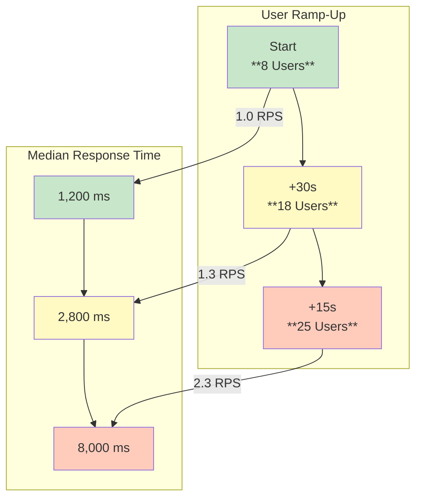

<!--
---
title: Performance Load Test Results
description: Detailed performance and stability analysis of the ResuMate API under simulated production load. This report presents factual data from a Locust load test, showcasing system reliability and response time metrics.
---
-->

# 📊 Performance Load Test Results

  

    
🚀 Production Load Test

    <h2>API Performance Analysis</h2>
    
Real-world performance metrics from 25 concurrent users on live production infrastructure

  

  
  

    

      
✅

      
100%

      
Success Rate

    

    

      
👥

      
25

      
Peak Users

    

    

      
⚡

      
85ms

      
Median Response

    

    

      
📈

      
7.2

      
Peak RPS

    

    

      
🚀

      
1,314

      
Total Requests

    

    

      
⏱️

      
3m 53s

      
Test Duration

    

  

---

## 🎯 Test Environment & Configuration

The load test was executed using Locust against a live production deployment to gather accurate performance data under real-world conditions.

  <table>
    <thead>
      <tr>
        <th>Configuration Parameter</th>
        <th>Value</th>
        <th>Details</th>
      </tr>
    </thead>
    <tbody>
      <tr>
        <td><strong>🖥️ Host Environment</strong></td>
        <td><code>https://arafat2.me</code></td>
        <td>Production deployment endpoint</td>
      </tr>
      <tr>
        <td><strong>☁️ Cloud Platform</strong></td>
        <td>DigitalOcean Droplet ($6/mo)</td>
        <td>Basic tier virtual private server</td>
      </tr>
      <tr>
        <td><strong>💻 System Resources</strong></td>
        <td>1 vCPU, 1GB RAM</td>
        <td>Minimal hardware configuration</td>
      </tr>
      <tr>
        <td><strong>⏱️ Test Duration</strong></td>
        <td>3 minutes 53 seconds</td>
        <td>Total load testing execution time</td>
      </tr>
      <tr>
        <td><strong>📅 Test Date</strong></td>
        <td>July 24, 2025</td>
        <td>Performance analysis timestamp</td>
      </tr>
      <tr>
        <td><strong>🐛 Testing Tool</strong></td>
        <td>Locust Load Testing Framework</td>
        <td>Python-based load testing platform</td>
      </tr>
    </tbody>
  </table>

---

## 📈 Performance Overview

  

    <h3>🎯 Key Highlights</h3>
    
The API demonstrated exceptional stability and performance, processing <strong>1,314 requests</strong> with <strong>zero failures</strong>. The median response time was a swift <strong>85ms</strong>, showcasing the system's efficiency under significant load.

  

  

    

      

        ✅
        <h4>Success & Throughput</h4>
      

      

        

          Total Requests
          1,314
        

        

          Failures
          0 (100% Success)
        

        

          Peak RPS
          7.2 req/s
        

      

    

    

      

        ⏱️
        <h4>Response Time (ms)</h4>
      

      

        

          Average
          800 ms
        

        

          Median (p50)
          85 ms
        

        

          95th Percentile
          7,100 ms
        

      

    

  

---

## 🔬 Endpoint-Specific Analysis

This section provides a detailed performance breakdown for each tested endpoint, categorized by functionality.

### 🔐 Authentication Endpoints

  <table>
    <thead>
      <tr>
        <th>Endpoint</th>
        <th>Method</th>
        <th>Requests</th>
        <th>Avg. Time</th>
        <th>Median</th>
        <th>95th %</th>
      </tr>
    </thead>
    <tbody>
      <tr>
        <td><strong><code>/api/auth/register/</code></strong></td>
        <td><code>POST</code></td>
        <td>74</td>
        <td>2,500ms</td>
        <td>1,300ms</td>
        <td>8,700ms</td>
      </tr>
      <tr>
        <td><strong><code>/api/auth/token/</code></strong></td>
        <td><code>POST</code></td>
        <td>17</td>
        <td>7,400ms</td>
        <td>7,600ms</td>
        <td>10,000ms</td>
      </tr>
    </tbody>
  </table>

### 🤖 AI-Powered Features

  <table>
    <thead>
      <tr>
        <th>Endpoint</th>
        <th>Method</th>
        <th>Requests</th>
        <th>Avg. Time</th>
        <th>Median</th>
        <th>95th %</th>
      </tr>
    </thead>
    <tbody>
      <tr>
        <td><strong><code>/api/ai/generate/</code></strong></td>
        <td><code>POST</code></td>
        <td>37</td>
        <td>11,800ms</td>
        <td>11,000ms</td>
        <td>20,000ms</td>
      </tr>
      <tr>
        <td><strong><code>/api/ai/models/</code></strong></td>
        <td><code>GET</code></td>
        <td>392</td>
        <td>274ms</td>
        <td>81ms</td>
        <td>530ms</td>
      </tr>
    </tbody>
  </table>

### 💼 Job Application Management

  <table>
    <thead>
      <tr>
        <th>Endpoint</th>
        <th>Method</th>
        <th>Requests</th>
        <th>Avg. Time</th>
        <th>Median</th>
        <th>95th %</th>
      </tr>
    </thead>
    <tbody>
      <tr>
        <td><strong><code>/api/job-applications/</code></strong></td>
        <td><code>POST</code></td>
        <td>93</td>
        <td>185ms</td>
        <td>86ms</td>
        <td>550ms</td>
      </tr>
      <tr>
        <td><strong><code>/api/job-applications/</code></strong></td>
        <td><code>GET</code></td>
        <td>309</td>
        <td>247ms</td>
        <td>87ms</td>
        <td>160ms</td>
      </tr>
    </tbody>
  </table>

---

## ⏳ Response Time Distribution

This table provides a detailed breakdown of the response time distribution across all requests, highlighting the latency experienced by different percentiles of users.

  <table>
    <thead>
      <tr>
        <th>Percentile</th>
        <th>Response Time (ms)</th>
        <th>Description</th>
      </tr>
    </thead>
    <tbody>
      <tr>
        <td><strong>50% (Median)</strong></td>
        <td>85 ms</td>
        <td>Half of the requests were completed in 85ms or less.</td>
      </tr>
      <tr>
        <td><strong>66%</strong></td>
        <td>120 ms</td>
        <td>Two-thirds of requests were faster than 120ms.</td>
      </tr>
      <tr>
        <td><strong>75%</strong></td>
        <td>150 ms</td>
        <td>Three-quarters of requests finished within 150ms.</td>
      </tr>
      <tr>
        <td><strong>80%</strong></td>
        <td>180 ms</td>
        <td>80% of requests were completed in 180ms or less.</td>
      </tr>
      <tr>
        <td><strong>90%</strong></td>
        <td>8,100 ms</td>
        <td>90% of users experienced a response time of 8.1 seconds or less.</td>
      </tr>
      <tr>
        <td><strong>95%</strong></td>
        <td>10,000 ms</td>
        <td>95% of requests were completed within 10 seconds.</td>
      </tr>
      <tr>
        <td><strong>98%</strong></td>
        <td>18,000 ms</td>
        <td>98% of requests were handled in 18 seconds or less.</td>
      </tr>
      <tr>
        <td><strong>99%</strong></td>
        <td>20,000 ms</td>
        <td>The top 1% of requests took 20 seconds or longer.</td>
      </tr>
      <tr>
        <td><strong>100% (Max)</strong></td>
        <td>21,000 ms</td>
        <td>The slowest request took 21 seconds to complete.</td>
      </tr>
    </tbody>
  </table>

---

## 📉 Scalability & Response Time Over Load

The data shows a direct correlation between the number of concurrent users and the API's response time. As the user load increased, latency grew significantly.

### Response Time Degradation

The following table illustrates how response times increased as more users were added to the test.

  <table>
    <thead>
      <tr>
        <th>Timestamp</th>
        <th>Concurrent Users</th>
        <th>RPS</th>
        <th>Median Response</th>
        <th>95th Percentile</th>
      </tr>
    </thead>
    <tbody>
      <tr>
        <td><code>02:07:56Z</code></td>
        <td>8</td>
        <td>1.0</td>
        <td>1,200ms</td>
        <td>1,500ms</td>
      </tr>
      <tr>
        <td><code>02:08:01Z</code></td>
        <td>18</td>
        <td>1.3</td>
        <td>2,800ms</td>
        <td>4,400ms</td>
      </tr>
      <tr>
        <td><code>02:08:16Z</code></td>
        <td>25</td>
        <td>2.3</td>
        <td>8,000ms</td>
        <td>10,000ms</td>
      </tr>
      <tr>
        <td><code>02:09:01Z</code></td>
        <td>25</td>
        <td>0.5</td>
        <td>19,000ms</td>
        <td>19,000ms</td>
      </tr>
    </tbody>
  </table>

---

!!! info "ℹ️ Test Report Details"
    **📊 Test Report Generated**: July 24, 2025 • **🔬 Testing Framework**: Locust v2.x • **🏗️ Environment**: Production (DigitalOcean)