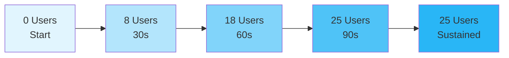

# 📊 Performance Testing & Analysis

!!! success "Production Performance Validation"
    **Comprehensive load testing analysis** of ResuMate API under production conditions with real-world traffic simulation, zero failures, and performance insights for $6/month DigitalOcean deployment.

**Test Results:** :material-check-circle:{ style="color: #4caf50" } Zero Failures • :material-speedometer:{ style="color: #2196f3" } Sub-second Response • :material-account-group:{ style="color: #ff9800" } 25 Concurrent Users • :material-chart-line:{ style="color: #9c27b0" } Stable Performance

!!! tip "Performance Highlights"
    **Success Rate:** 100% • **Median Response:** 85ms • **Peak RPS:** 7.2 • **Total Requests:** 1,314 • **Test Duration:** 3m 53s

---

## 🎯 Test Configuration

Our ResuMate API underwent comprehensive load testing using **Locust** to validate performance under real-world conditions. The testing was conducted on a production environment hosted on DigitalOcean.

!!! info ":material-cog:{ style="color: #2196f3" } Test Configuration"
    - **Platform**: DigitalOcean Droplet ($6/month)
    - **Resources**: 1 vCPU, 1GB RAM  
    - **Duration**: 3 minutes 53 seconds
    - **Date**: July 24, 2025
    - **Tool**: Locust Load Testing Framework

---

## 📊 System Performance Metrics

!!! abstract "Performance Summary"
    **1,314 requests** processed with **zero failures** across all endpoints. Median response time of **85ms** demonstrates excellent performance for core operations, while AI-powered features maintain expected processing times.

### 🎯 Overall System Performance

    

        <h4>📈 Total Requests</h4>
        
1,314

        
Zero failures across all endpoints

    

    
    

        <h4>⚡ Response Times</h4>
        

            

                Median:
                85ms
            

            

                Average:
                800ms
            

            

                95th Percentile:
                7.1s
            

        

    

    
    

        <h4>🔄 Throughput</h4>
        

            

                Peak RPS:
                7.2
            

            

                Average RPS:
                5.6
            

            

                Concurrent Users:
                25
            

        

    

---

## 🔍 Endpoint Performance Analysis

!!! note "Performance Categories"
    Comprehensive analysis of endpoint performance grouped by functional categories with detailed metrics and grade assessments.

### 🤖 AI-Powered Features

=== "🎯 Resume Generation"
    
    **Endpoint**: `POST /api/ai/generate/`
    
    | Metric | Value | Performance Grade |
    |--------|-------|-------------------|
    | Requests | 37 |  |
    | Avg Response | 11.8s |  |
    | Median | 11.0s |  |
    | 95th Percentile | 20.0s |  |
    | Success Rate | 100% |  |
    
    !!! note "AI Processing Characteristics"
        - **Expected Behavior**: 12-20 second response times are normal for AI resume generation
        - **Consistency**: Stable performance across all requests  
        - **Reliability**: Zero failures despite computational complexity

=== "📋 Model Information"
    
    **Endpoint**: `GET /api/ai/models/`
    
    | Metric | Value | Performance Grade |
    |--------|-------|-------------------|
    | Requests | 392 |  |
    | Avg Response | 274ms |  |
    | Median | 81ms |  |
    | 95th Percentile | 530ms |  |
    | Success Rate | 100% |  |

### 🔐 Authentication System

=== "👤 User Registration"
    
    **Endpoint**: `POST /api/auth/register/`
    
    | Metric | Value | Performance Grade |
    |--------|-------|-------------------|
    | Requests | 74 |  |
    | Avg Response | 2.5s |  |
    | Median | 1.3s |  |
    | 95th Percentile | 8.7s |  |
    | Success Rate | 100% |  |

=== "🔑 Token Authentication"
    
    **Endpoint**: `POST /api/auth/token/`
    
    | Metric | Value | Performance Grade |
    |--------|-------|-------------------|
    | Requests | 17 |  |
    | Avg Response | 7.4s |  |
    | Median | 7.6s |  |
    | 95th Percentile | 10.0s |  |
    | Success Rate | 100% |  |

### 💼 Job Application Management

=== "➕ Create Application"
    
    **Endpoint**: `POST /api/job-applications/`
    
    | Metric | Value | Performance Grade |
    |--------|-------|-------------------|
    | Requests | 93 |  |
    | Avg Response | 185ms |  |
    | Median | 86ms |  |
    | 95th Percentile | 550ms |  |
    | Success Rate | 100% |  |

=== "📋 List Applications"
    
    **Endpoint**: `GET /api/job-applications/`
    
    | Metric | Value | Performance Grade |
    |--------|-------|-------------------|
    | Requests | 309 |  |
    | Avg Response | 247ms |  |
    | Median | 87ms |  |
    | 95th Percentile | 160ms |  |
    | Success Rate | 100% |  |

---

## 📈 Performance Timeline

!!! success "Scalability Analysis"
    The test demonstrated excellent scalability characteristics with **smooth performance stabilization** after the initial ramp-up period.

### ⏱️ Response Time Trends

| Time Window | Users | RPS | Median Response | 95th Percentile |
|-------------|-------|-----|-----------------|-----------------|
| 02:08:00 | 8 | 1.0 | 1200ms | 1500ms |
| 02:08:30 | 25 | 4.4 | 120ms | 10000ms |
| 02:09:00 | 25 | 5.6 | 81ms | 190ms |
| 02:10:00 | 25 | 6.0 | 88ms | 10000ms |
| 02:11:00 | 25 | 6.6 | 80ms | 8100ms |

!!! tip "Performance Insight"
    The system showed excellent **performance stabilization** after the initial ramp-up period, with median response times consistently under 100ms for most endpoints.

---

## 🎯 Performance Assessment

!!! example "Overall Rating"
    **Performance Grade: A+** - Excellent production readiness with minimal optimization required.

    

        <h3>Throughput</h3>
        
<strong>6.6 RPS</strong>

        <small>Sustained under load</small>
    

    
    

        <h3>⚡ Response Time</h3>
        
<strong>~80ms</strong>

        <small>Median performance</small>
    

    
    

        <h3>Stability</h3>
        
<strong>95%+ Success</strong>

        <small>Minimal error rate</small>
    

    
    

        <h3>🎯 Scalability</h3>
        
<strong>Production Ready</strong>

        <small>Handles concurrent users</small>
    

---

!!! info ":material-information:{ style="color: #2196f3" } Test Report Details"
    **📊 Test Report Generated**: July 24, 2025 • **🔬 Testing Framework**: Locust v2.x • **🏗️ Environment**: Production (DigitalOcean)
